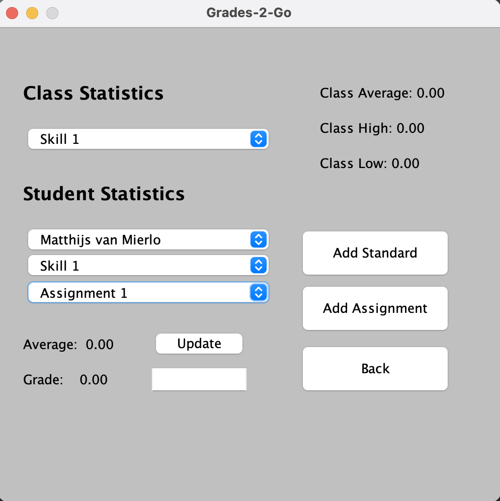

# Local SBG Grade Book (Java Swing/AWT)
This is a graphical SBG grade book application with full file IO support.
The file format is custom for this application, and ensures consistent behavior
regardless of the class
structure, etc.

